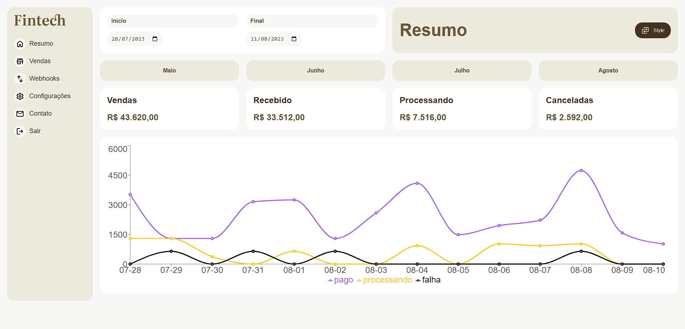

# Fintech - See your data with Bento UI design 📚

<br>

<p align="center">
  <a href="#-about-the-project">About the project</a> •
  <a href="#-technologies">Technologies</a> •
  <a href="#-getting-started">Getting started</a> •
  <a href="#-license">License</a>
</p>

<p align="center">
 
 
  
</p>

## 👩‍💻 About the project

A project crafted to deliver a comprehensive exploration of TypeScript and a current UI trend, BENTO UI.

The project includes interactive charts using the Recharts library, ensuring full responsiveness, along with a button to switch between the available themes.

Moreover, it initiates an API call to retrieve sales data from the preceding three months, populating the charts with relevant information.

[click here, see closer](https://fintech-cs.netlify.app/) 😉

## 🚀 Technologies

- [Recharts](https://recharts.org/en-US/)
- [Typescript](https://www.typescriptlang.org/)
- [Vite](https://vitejs.dev/)

## 💻 Getting started

### Requirements

- [Node.js](https://nodejs.org/en/)
- [Yarn](https://classic.yarnpkg.com/) or [NPM](https://www.npmjs.com/) _(examples are with NPM)_

**Clone the project and access the folder**

```bash
$ git clone https://github.com/leandrorodrigues00/fintech && cd fintech

```

**Follow the steps below**

```bash
# Install the dependencies
$ npm i

# Start the app
$ npm run dev
```

## 📝 License

This project is licensed under the MIT License - see the [LICENSE](LICENSE) file for details.

---

<p align="center">
  Made with 💜&nbsp; by Leandro Rodrigues<br>
  as the final project of the React with TypeScript course by <a href="https://www.origamid.com/">Origamid</a>
</p>
